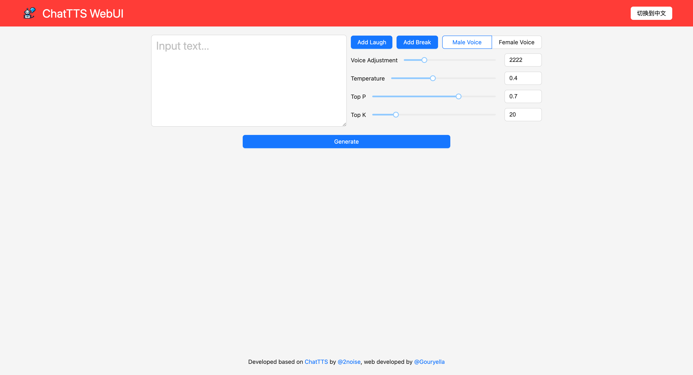
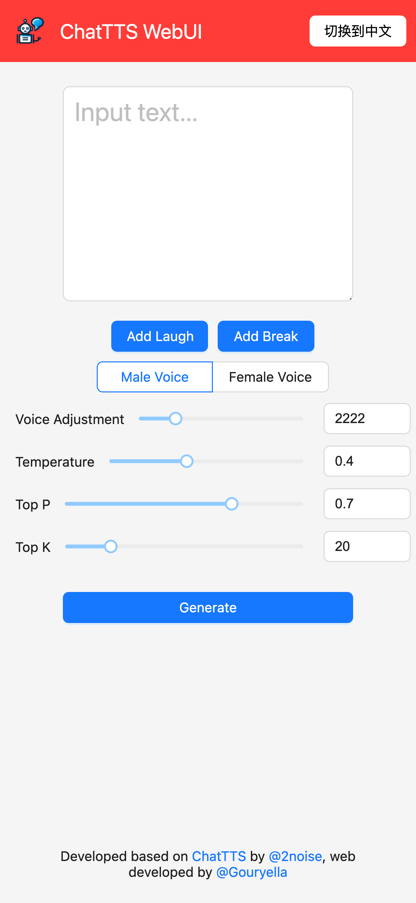

# ChatTTS-Nuxt3 Webui

Developed based on [ChatTTS](https://github.com/2noise/ChatTTS/) by [@2noise](https://2noise.com/), web developed by [@Gouryella](https://github.com/Gouryella)

Try It Free at https://chattts.201lab.top

<table>
  <tr>
    <td align="center">Web UI</td>
    <td align="center">Mobile UI</td>
  </tr>
  <tr>
    <td></td>
    <td></td>
  </tr>
</table>

## Last Update
1. Update API, add detailed parameter adjustment.
2. Update webui.
3. Update mobile view
## How to use
### Step 1
```bash
git clone https://github.com/Gouryella/ChatTTS-webui.git
cd ChatTTS-webui
npm install
```
### Step 2
```bash
yes | conda create -n chattts python=3.10
conda activate chattts
yes | conda install pytorch==2.2.2 torchvision==0.17.2 torchaudio==2.2.2 pytorch-cuda=12.1 -c pytorch -c nvidia

# If you are using Mac OS or do not support CUDA, use
pip install torch==2.2.2 torchvision==0.17.2 torchaudio==2.2.2

pip install -r requirements.txt
```


### Step 3
```bash
cd api
git clone https://github.com/2noise/ChatTTS.git && cd ChatTTS && git checkout a0a1a9f && cd ..
git clone https://huggingface.co/2Noise/ChatTTS.git models
cd ..
```

### Step 4
```bash
npm run dev
python api/server.py
```


### Use Docker
```bash
wget https://raw.githubusercontent.com/Gouryella/ChatTTS-webui/main/docker/Dockerfile
docker build -t chattts_webui .
docker run -itd --name chattts_webui --gpus all -p 3000:3000 -p 8000:8000  chattts_webui
```